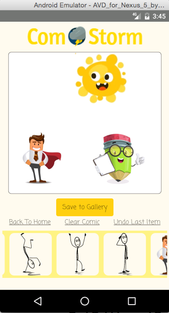
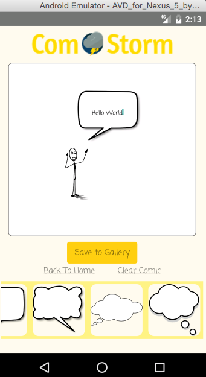
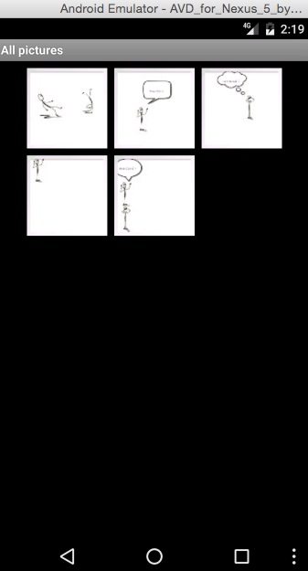

# ComStorm

## Background

ComStorm is a mobile app for creating comic panels, built using React Native, for Android platform. This app is intended to improve the poor quality of content in newspaper comics after the retirement of Bill Watterson. With how easy it is to get carpal tunnel syndrome, this app might end up saving lives :).

## Features and Implementation

### Click and Drag Images



### Elements With Wrapped Text Input



There are three types of text input which can be added to the scene. Each gets wrapped in a draggable element (described above) upon being rendered in the drawing area. A onPress handler which calls dismissKeyboard was applied to a TouchableWithoutFeedback tag which wraps the drawing area to dismiss the keyboard upon pressing any empty space in the drawing area.

```javascript
  <TouchableWithoutFeedback style={styles.dismiss} onPress={()=>     dismissKeyboard()}>
    <View style={styles.view}>
      {rendered_objects}
    </View>
  </TouchableWithoutFeedback>
```

#### Speech and Thought Bubbles
The text-in-bubble effect was implemented by applying position: relative to the image of a speech or thought bubble, and position: absolute on the textInput element to achieve the overlay effect. Carefully chosen character limits and sizing ensure a good fit.

#### Captions
Captions can be added by clicking the 'Add Caption' element in the slider. This element uses the same logic as the speech and thought bubbles but different styling was applied using a conditional check for the filename.

### Save Comics to Phone Gallery



Upon clicking the `Save to Gallery` button, the app takes a screenshot of the comic panel and saves it to the phone's gallery. This feature was implemented using the following libraries:

- `react-native-view-shot`: To take a screenshot of the panel
- `react-native-fs`: To save the image to local storage
- `react-native-fetch-blob`: To transfer the image file to the phone's gallery

```javascript
  class SaveButton extends Component {

    save() {
      takeSnapshot( this.slider.refs["mainView"], {
        format: "jpeg",
        quality: 0.8
      })
      .then((uri) => this.copyImage(uri));
    }

    copyImage(uri) {
      let timestamp = Date.now();
      let fileName = "comic_" + timestamp + ".jpeg";
      let destFileLocation = RNFS.PicturesDirectoryPath + '/' + fileName;
      let localFilePath = uri.replace(/file:\/\//, "");
      RNFS.copyFile(localFilePath, destFileLocation)
        .then(() => console.log("Copied File"));
      RNFetchBlob.fs.scanFile([ { path: destFileLocation, mime: "image/jpeg" } ])
        .then(() => console.log("Scanned image file successfully"));
        .catch((err) => console.log("Unable to scan image file"));
    }
  }
```

## Future Directions for the Project

### Upload Images

Users will be allowed to upload and use their own images in the comic panels.

### Authentication

Users can create accounts with ComStorm and keep a record of all comics they created.

### Backgrounds

Custom backgrounds can be applied to comic panels.

### IOS Support

The current implementation of ComStorm is only available to Android users. It will also be available to IOS users.
