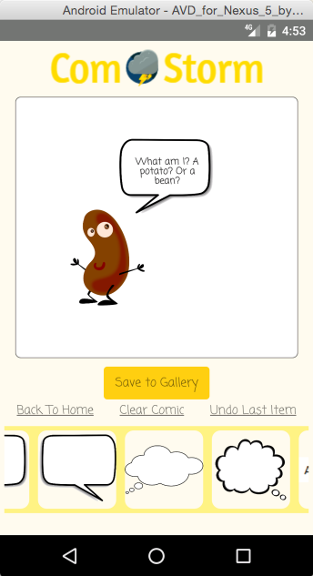
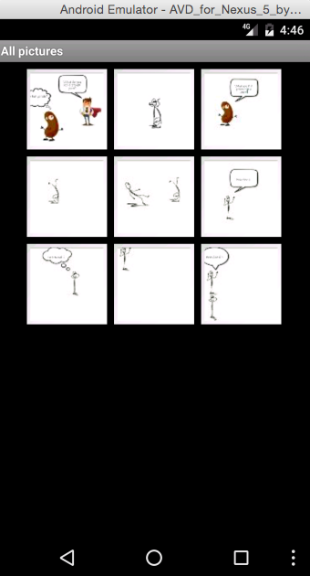

# ComStorm

## Background

ComStorm is a mobile app for creating comic panels, built using React Native, for Android platform. This app is intended to improve the poor quality of content in newspaper comics after the retirement of Bill Watterson. With how easy it is to get carpal tunnel syndrome, this app might end up saving lives :).

## Features and Implementation

### Click and Drag Images


### Add Text Input in Speech and Thought Bubbles



### Save Comics to Phone Gallery



Upon clicking the `Save to Gallery` button, the app takes a screenshot of the comic panel and saves it to the phone's gallery. This feature was implemented using the following libraries:

- `react-native-view-shot`: To take a screenshot of the panel
- `react-native-fs`: To save the image to local storage
- `react-native-fetch-blob`: To transfer the image file to the phone's gallery

```javascript
  class SaveButton extends Component {

    save() {
      takeSnapshot( this.slider.refs["mainView"], {
        format: "jpeg",
        quality: 0.8
      })
      .then((uri) => this.copyImage(uri));
    }

    copyImage(uri) {
      let timestamp = Date.now();
      let fileName = "comic_" + timestamp + ".jpeg";
      let destFileLocation = RNFS.PicturesDirectoryPath + '/' + fileName;
      let localFilePath = uri.replace(/file:\/\//, "");
      RNFS.copyFile(localFilePath, destFileLocation)
        .then(() => console.log("Copied File"));
      RNFetchBlob.fs.scanFile([ { path: destFileLocation, mime: "image/jpeg" } ])
        .then(() => console.log("scan file success"));
        .catch((err) => console.log("scan file error"));
    }
  }
```

## Future Directions for the Project

### Upload Images

Users will be allowed to upload and use their own images in the comic panels.

### Authentication

Users can create accounts with ComStorm and keep a record of all comics they created.

### Backgrounds

Custom backgrounds can be applied to comic panels.

### IOS Support

The current implementation of ComStorm is only available to Android users. It will also be available to IOS users.
