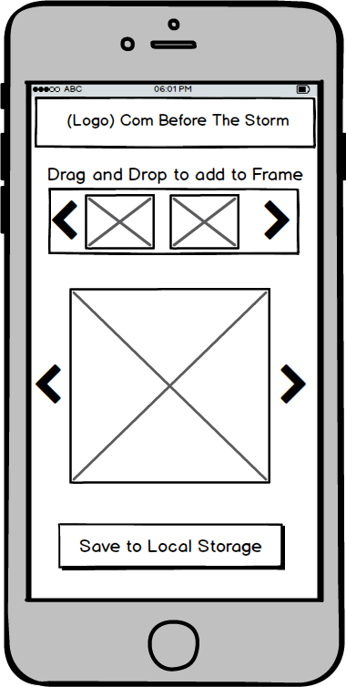

## ComStorm

### Background

ComStorm is a mobile app for making comics, built using React Native. This app is intended to improve the poor quality of content in newspaper comics after the retirement of Bill Watterson. With how easy it is to get carpal tunnel syndrome, this app might end up saving lives :).

### Functionality and MVP

Users will be able to

- [ ] click templates and drag to reposition in the drawing box
- [ ] add text to speech and thought bubbles
- [ ] save the created comic strip to their phone's gallery

### Wireframes

1.    
 2.   

### Technologies and Technical Challenges

This app will be built using React Native and vanilla JavaScript. React Native will also be used for the styling.

The technical challenges of this project will be:

- Determining the implementation of drag and drop for figures and bubbles on to the canvas.
- Determining the implementation of slider listing figures and bubbles.
- Identifying ways to incorporate text input inside speech and thought bubbles.
- Storing a user's creations in internal storage.

### Group Members and Work Breakdown

Our group has three members, Nate Reiners, Ken Lee and Nandini Adhyapaka.

Nate's primary responsibilities will be:

- Text Input
- Local Storage

Ken's primary responsibilities will be:

- Drag and Drop
- Canvas equivalent in React Native or grid layout depending

Nandini's primary responsibilities will be:

- Sliders
- Styling

### Implementation Timeline

**Day 1**:

- Build basic file structure and skeleton
- Install necessary dependencies and setup testing environment
- Design Logo

**Day 2**:

- Basic GUI setup and minimal functionality beginning
- Design out local storage implementation
- Make progress on Drag and Drop
- Implement Sliders

**Day 3**:

- Finish anything leftover from Day 2
- Text Input
- Canvas Equivalent in React Native
- Local Storage

**Day 4**:

- Finish anything leftover from Day 3
- Styling first draft
- Bugfixing

**Day 5**:

- Polish Style
- Finish App and all bugfixes

### Plan for getting users and reviews

- Spread the app on LinkedIn and Facebook/Twitter.
- Have it featured in an article on Wall Street Journal, Wired, Tech Crunch, or Reddit.

### Bonus Features

- Allow users to upload their own images
- User authentication
- Custom backgrounds and colors
- Cross platform support to IOS
